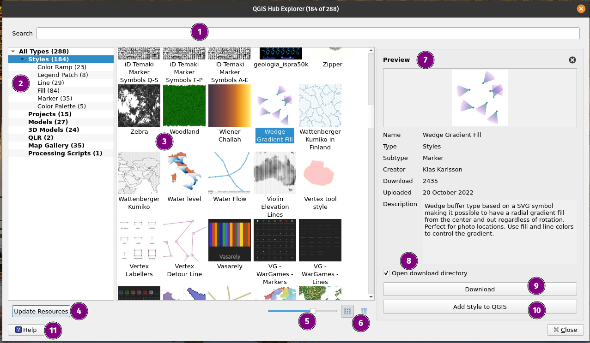

# {{ title }} - Documentation

**Description:** {{ description }}

**Author and contributors:** {{ author }}

**Plugin version:** {{ version }}

**QGIS minimum version:** {{ qgis_version_min }}

**QGIS maximum version:** {{ qgis_version_max }}

**Source code:** {{ repo_url }}

**Last documentation update:** {{ date_update }}

## Introduction

[The official QGIS Hub website](https://plugins.qgis.org/styles/?order_by=-upload_date&&is_gallery=true) offers a collection of useful QGIS resource from QGIS style, layer, and processing model. This QGIS Hub plugin helps you to browse the resources available and add it directly to your QGIS.



Features:

1. Search by resource's name or creator
2. Filter by resource type
3. Resource shown as grid or list:

   - On the grid view, the thumbnail can be resized
   - On the list view, the list can be sorted by resource's name, creator's name, download count, or uploaded date

4. Get the latest update of the resources from the QGIS Hub plugin
5. Resize the thumbnail (only works on grid view)
6. Button to toggle between grid or list view
7. Preview of the currently selected resource
8. Option to open the download directory right after download
9. Add the resource directly to QGIS:

   - Style will be added to your style manager
   - Model will be added to your profile model directory and shown directly on your QGIS
   - Geopackage will be downloaded on your disk and loaded directly

10. Download the resource on your disk (without adding to QGIS)
11. Open this help page

## Acknowledgement

The initial idea of the plugin is coming from [Tim Sutton](https://github.com/timlinux), on [QGIS Contributor Meeting 2023 's-Hertogenbosch](https://github.com/qgis/QGIS/wiki/25th-Contributor-Meeting-in-'s-Hertogenbosch). The plugin has been developed by [Ismail Sunni](https://github.com/ismailsunni) and [Ronit Jadhav](https://github.com/ronitjadhav) as part of the [Camptocamp](https://www.camptocamp.com/en) open source contribution.

---

```{toctree}
---
caption: Usage
maxdepth: 1
---
Installation <usage/installation>
```

```{toctree}
---
caption: Contribution guide
maxdepth: 1
---
development/contribute
development/environment
development/documentation
development/translation
development/packaging
development/testing
development/history
```
